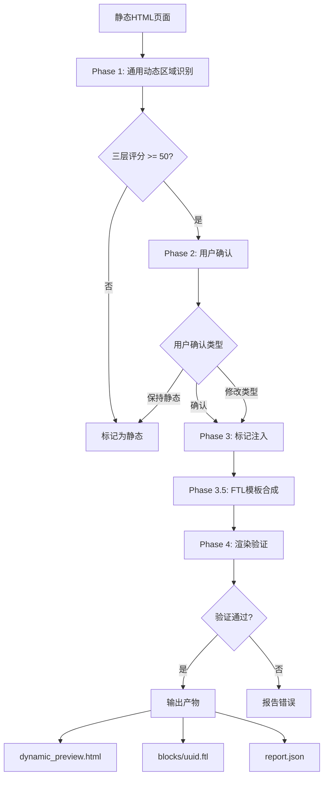
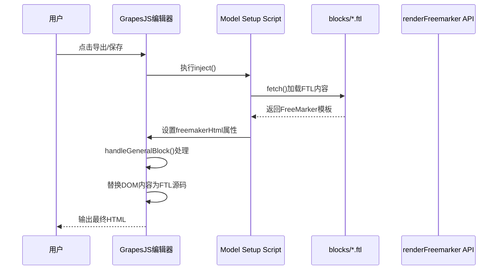

# Skill Oxygen 项目思维导图

## Mermaid 思维导图

```mermaid
mindmap
  root((Skill Oxygen))
    核心定位
      静态HTML转动态模块
      标记注入而非结构替换
      100%保留原始样式
      FreeMarker模板合成

    核心Skills
      Dynamic Module Converter
        四阶段转换流程
          Phase1:通用动态区域识别
            自底向上检测
            三层评分算法
            结构40%+URL25%+内容20%
          Phase2:用户确认
            逐一确认区块类型
            零自动转换
          Phase3:标记注入
            developer-component包装
            data-block-type属性
            Model Setup Script
          Phase3.5:FTL模板合成
            保留原始HTML结构
            @api查询块
            [#list]循环
          Phase4:渲染验证
            DOM层级检查73项
            JS语法验证
            视觉结构对比25项
            导出路径模拟41项
        支持22+区块类型
          产品列表/分组
          文章列表/详情
          图库/视频/下载
          FAQ/搜索/站点地图
        输出产物
          dynamic_preview.html
          blocks/uuid.ftl
          报告JSON

      Template Fetcher
        抓取平台模板
          Playwright自动登录
          分页扫描应用列表
          提取view_default文件
        过滤选项
          按类型 -t
          按关键词 -k
          按JSON配置 -j
        输出产物
          *.ftl模板文件
          _registry.json索引

      PUA Skill
        AI激励引擎
          三条铁律
            穷尽一切方案
            先做后问
            主动出击
          五步方法论
            闻味道-诊断卡壳
            揪头发-拉高视角
            照镜子-自检
            执行新方案
            复盘
          压力等级L1-L4
          七项检查清单

    技术栈
      Node.js >=18
      Cheerio HTML解析
      Inquirer 交互CLI
      Playwright 浏览器自动化
      FreeMarker 模板引擎
      UUID 唯一标识

    项目结构
      .claude/skills/
        dynamic-module-converter/
          scripts/ 转换脚本
          references/ 参考文档
          templates/ 模板文件
          blocks/ 输出区块
        template-fetcher/
          scripts/ 抓取脚本
        pua/
      src/
        pages/ 页面文件
        Generate/ 转换输出
        tools/ 开发工具
          api-tester.html
          proxy-server.mjs
          page-renderer.mjs
        fetch_config/ 抓取配置
        docs/ 项目文档

    开发工具
      API测试器
        renderFreemarker接口
      代理服务器
        CORS代理 :3456
      页面渲染器
        FTL渲染服务 :3457

    NPM脚本
      npm test 转换+验证
      npm run convert 执行转换
      npm run verify:all 全部验证
      npm run render-server 渲染服务
```

## 文本树形结构图

```
Skill Oxygen - 静态HTML到动态FreeMarker模块转换工具集
│
├── 🎯 核心定位
│   ├── 静态HTML → 动态FreeMarker模块
│   ├── 标记注入而非结构替换
│   ├── 100%保留原始HTML结构和样式
│   └── 以原始HTML为骨架合成模板
│
├── 🔧 核心Skills
│   │
│   ├── 📦 Dynamic Module Converter (核心转换器)
│   │   │
│   │   ├── 📋 四阶段转换流程
│   │   │   ├── Phase 1: 通用动态区域识别
│   │   │   │   ├── 自底向上检测（不依赖特定标签）
│   │   │   │   ├── 找>=3重复子元素的容器
│   │   │   │   ├── 向上回溯找语义边界
│   │   │   │   └── 三层评分算法
│   │   │   │       ├── Layer 1: 结构特征 (0-40分)
│   │   │   │       ├── Layer 2: URL模式 (0-25分)
│   │   │   │       └── Layer 3: 内容启发 (0-20分)
│   │   │   │
│   │   │   ├── Phase 2: 用户确认
│   │   │   │   ├── 展示所有发现的区块
│   │   │   │   ├── 确认/修改类型/保持静态
│   │   │   │   └── 零自动转换 - 必须显式批准
│   │   │   │
│   │   │   ├── Phase 3: 标记注入
│   │   │   │   ├── developer-component外层包装
│   │   │   │   ├── developer-node-component内层
│   │   │   │   ├── data-block-type属性
│   │   │   │   ├── data-block-uuid唯一标识
│   │   │   │   └── Model Setup Script引用.ftl
│   │   │   │
│   │   │   ├── Phase 3.5: FTL模板合成
│   │   │   │   ├── 提取@api查询块
│   │   │   │   ├── 识别重复项→[#list]循环
│   │   │   │   ├── 字段映射（按类型）
│   │   │   │   └── 输出blocks/{uuid}.ftl
│   │   │   │
│   │   │   └── Phase 4: 渲染验证
│   │   │       ├── DOM层级检查 (73项)
│   │   │       ├── JS语法验证
│   │   │       ├── 视觉结构对比 (25项)
│   │   │       ├── 导出路径模拟 (41项)
│   │   │       └── 边界场景测试 (9项)
│   │   │
│   │   ├── 📚 支持22+区块类型
│   │   │   ├── 产品相关
│   │   │   │   ├── phoenix_blocks_prodlist (产品列表)
│   │   │   │   ├── phoenix_blocks_groupProduct (产品分组)
│   │   │   │   └── phoenix_blocks_prodDetail (产品详情)
│   │   │   │
│   │   │   ├── 文章相关
│   │   │   │   ├── phoenix_blocks_Articlelist (文章列表)
│   │   │   │   ├── phoenix_blocks_groupArticle (文章分组)
│   │   │   │   └── phoenix_blocks_articleDetail (文章详情)
│   │   │   │
│   │   │   ├── 媒体相关
│   │   │   │   ├── phoenix_blocks_galleryList (图库)
│   │   │   │   └── phoenix_blocks_videoList (视频)
│   │   │   │
│   │   │   └── 其他
│   │   │       ├── phoenix_blocks_downloadlist (下载)
│   │   │       ├── phoenix_blocks_faqList (FAQ)
│   │   │       ├── phoenix_blocks_search (搜索)
│   │   │       └── phoenix_blocks_siteMap (站点地图)
│   │   │
│   │   └── 📄 输出产物
│   │       ├── pages/dynamic_preview.html (标准输出)
│   │       ├── pages/dynamic_preview_inline.html (内联版本)
│   │       ├── blocks/{uuid}.ftl (独立FTL模板)
│   │       └── reports/*.json (检测/注入/验证报告)
│   │
│   ├── 🔄 Template Fetcher (模板抓取器)
│   │   │
│   │   ├── 🔍 抓取流程
│   │   │   ├── Playwright登录 → Session cookie
│   │   │   ├── 扫描应用列表 /app/faced/list
│   │   │   ├── 获取文件列表 /app/faced/file/list
│   │   │   ├── 提取文件内容 /app/faced/get/file
│   │   │   └── 写入_registry.json索引
│   │   │
│   │   ├── ⚙️ 过滤选项
│   │   │   ├── -t/--type 按应用类型
│   │   │   ├── -k/--keyword 按关键词
│   │   │   ├── -j/--from-json 从JSON配置
│   │   │   ├── -i/--incremental 增量更新
│   │   │   └── --app-ids 指定应用ID
│   │   │
│   │   └── 📄 输出产物
│   │       ├── templates/fetched/*.ftl
│   │       └── templates/fetched/_registry.json
│   │
│   └── 💪 PUA Skill (AI激励引擎)
│       │
│       ├── 📜 三条铁律
│       │   ├── 铁律一: 穷尽一切方案
│       │   ├── 铁律二: 先做后问
│       │   └── 铁律三: 主动出击
│       │
│       ├── 🔧 五步方法论
│       │   ├── Step 1: 闻味道 - 诊断卡壳模式
│       │   ├── Step 2: 揪头发 - 拉高视角(5维度)
│       │   ├── Step 3: 照镜子 - 自检
│       │   ├── Step 4: 执行新方案
│       │   └── Step 5: 复盘
│       │
│       ├── 📊 压力等级
│       │   ├── L1 温和失望 (第2次失败)
│       │   ├── L2 灵魂拷问 (第3次失败)
│       │   ├── L3 361考核 (第4次失败)
│       │   └── L4 毕业警告 (第5次+)
│       │
│       └── ✅ 七项检查清单
│           ├── 读失败信号
│           ├── 主动搜索
│           ├── 读原始材料
│           ├── 验证前置假设
│           ├── 反转假设
│           ├── 最小隔离
│           └── 换方向
│
├── 💻 技术栈
│   ├── Node.js >= 18
│   ├── Cheerio - HTML解析
│   ├── Inquirer - 交互式CLI
│   ├── Playwright - 浏览器自动化
│   ├── FreeMarker - 模板引擎
│   └── UUID - 唯一标识生成
│
├── 📁 项目结构
│   ├── .claude/skills/ - Claude Code Skills
│   │   ├── dynamic-module-converter/
│   │   │   ├── scripts/ - 转换和验证脚本
│   │   │   ├── references/ - 参考文档
│   │   │   ├── templates/ - 模板文件
│   │   │   └── blocks/ - 输出区块
│   │   ├── template-fetcher/
│   │   │   └── scripts/ - 抓取脚本
│   │   └── pua/
│   │       └── SKILL.md
│   │
│   └── src/ - 源代码
│       ├── pages/ - 页面文件
│       ├── Generate/ - 转换输出(时间戳目录)
│       ├── tools/ - 开发工具
│       ├── fetch_config/ - 抓取配置
│       └── docs/ - 项目文档
│
├── 🛠️ 开发工具
│   ├── api-tester.html - API接口测试页面
│   ├── proxy-server.mjs - CORS代理服务器 (:3456)
│   └── page-renderer.mjs - FTL渲染服务 (:3457)
│
├── 📜 NPM脚本
│   ├── npm test - 转换+全套验证
│   ├── npm run convert - 执行转换
│   ├── npm run verify - DOM验证(73项)
│   ├── npm run verify:js - JS语法验证
│   ├── npm run verify:visual - 视觉对比(25项)
│   ├── npm run verify:export - 导出模拟(41项)
│   ├── npm run verify:edge - 边界测试(9项)
│   ├── npm run verify:all - 全部验证
│   └── npm run render-server - 启动渲染服务
│
└── 🔗 工作流程
    ├── 1. /fetch-templates → 获取模板
    ├── 2. /convert-dynamic → 转换HTML
    └── 3. verify:all → 验证结果
```

## 流程图

### 转换流程



### 检测算法流程

```mermaid
flowchart LR
    subgraph Layer1[Layer 1: 结构特征]
        A1[统计相同标签签名]
        A2[>=9项→40分]
        A3[>=5项→35分]
        A4[>=3项→25分]
    end

    subgraph Layer2[Layer 2: URL模式]
        B1[/product/→产品]
        B2[/blog/→文章]
        B3[/gallery/→图库]
        B4[/video/→视频]
    end

    subgraph Layer3[Layer 3: 内容启发]
        C1[价格符号→产品]
        C2[日期模式→文章]
        C3[iframe/video→视频]
        C4[手风琴→FAQ]
    end

    Layer1 --> D{总分>=50?}
    Layer2 --> D
    Layer3 --> D
    D -->|是| E[确认为动态区块]
    D -->|否| F[标记为静态]
```

### 导出流程



## 类型检测对照表

| 视觉特征 | 结构特征 | URL模式 | 区块类型 |
|---------|---------|---------|---------|
| 卡片+图片+价格 | ≥3重复子元素 | /product/, /p/ | prodList |
| 卡片+图片+日期 | ≥3重复子元素 | /blog/, /news/ | Articlelist |
| 图片网格 | ≥3重复子元素 | /gallery/ | galleryList |
| 视频缩略图 | ≥3重复子元素 | /video/, youtube | videoList |
| 问答折叠 | 手风琴结构 | /faq/ | faqList |
| 下载按钮+文件名 | ≥3重复子元素 | /download/ | downloadlist |

## 验证检查项分布

```
总检查项: 148+
├── DOM结构验证: 73项
│   ├── 层级关系
│   ├── 属性完整性
│   └── 标记正确性
├── 视觉对比: 25项
│   ├── CSS完整性
│   ├── 静态区保留
│   └── 元素数量
├── 导出模拟: 41项
│   ├── FTL文件存在
│   ├── fetch路径正确
│   └── 模板语法有效
├── JS语法: 多项
│   ├── 语法正确性
│   └── 运行时验证
└── 边界场景: 9项
    ├── 空文件
    ├── 全静态
    ├── 混合内容
    └── 压力测试
```
